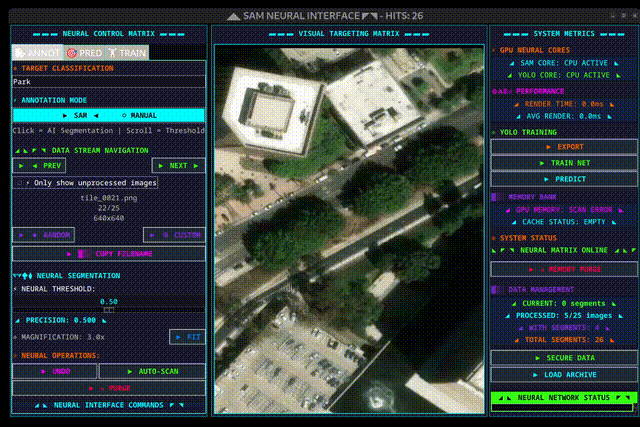
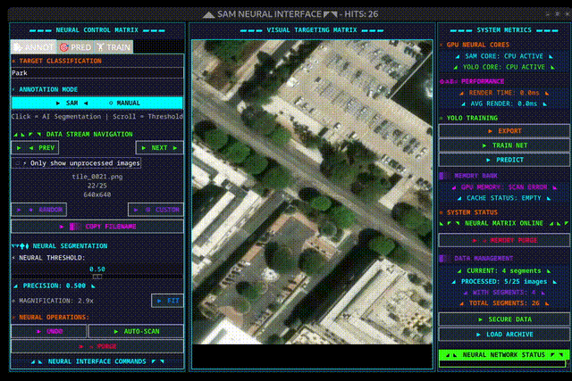
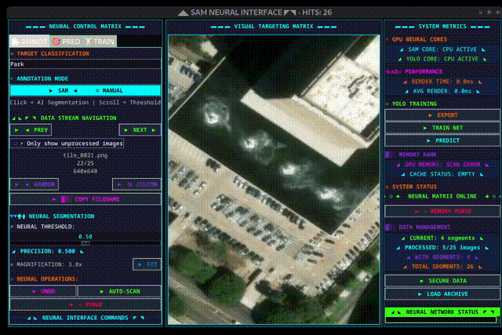
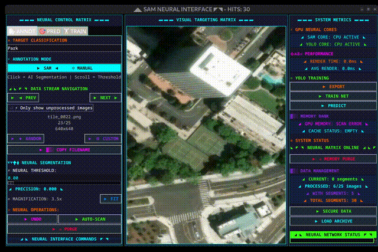

# ApexLabel

```
    ___                   __          __         __
   /   |  ____  ___  _  _/ /   ____ _/ /_  ___  / /
  / /| | / __ \/ _ \| |/_/ /   / __ `/ __ \/ _ \/ /
 / ___ |/ /_/ /  __/>  </ /___/ /_/ / /_/ /  __/ /
/_/  |_/ .___/\___/_/|_/_____/\__,_/_.___/\___/_/
      /_/
```


**Free and open-source** object detection annotation tool with SAM click-to-segment. Train a YOLO model directly in the app using your annotations, then use it to auto-label new images, just review and tweak predictions instead of annotating from scratch. Bootstrap your way to a full dataset in a fraction of the time.

I'm not much of a designer, so I tried to make it look like early 2000s freeware.

<p align="center">
  
</p>

---

## Key Features

- **Auto-save** — Annotations save automatically when you navigate to a new image. No manual saving required.

- **YOLO Bootstrap Training** — Train a YOLO model on your annotations, then enable prediction assist. The model pre-labels new images so you just tweak the predictions instead of starting from scratch.

- **LLaVA Validation** — Optional LLM-powered validation using LLaVA to review annotations and filter false positives. Useful for large datasets where manual review isn't feasible.

---

## How It Works

### Click to Segment

Click on any object and SAM automatically creates a segmentation mask.

<p align="center">
  
</p>

### Pan and Zoom

`Ctrl+Scroll` to zoom. Hold `Space` and drag to pan.

<p align="center">
  
</p>

### Manual Mode + Delete

Switch to manual mode to draw bounding boxes. `Shift+Click` to delete annotations.

<p align="center">
  
</p>

### Undo

`Ctrl+Z` to undo.

<p align="center">
  
</p>

---

## Tech Stack

| Component | Technology |
|:----------|:-----------|
| Segmentation | [Segment Anything (SAM)](https://github.com/facebookresearch/segment-anything) |
| Object Detection | [Ultralytics YOLO](https://github.com/ultralytics/ultralytics) |
| Deep Learning | PyTorch |
| GUI | tkinter |
| Vision Validation | LLaVA (optional) |

---

## Getting Started

```bash
./scripts/install_dependencies.sh
source .venv/bin/activate

# Set your class names
cp config/default_config.yaml config.yaml
# Edit config.yaml → class_names: ["your_object"]

# Launch
python -m sam_annotation --config config.yaml /path/to/images
```

---

## Satellite Imagery

Need sample images? Download tiles from ArcGIS World Imagery:

```bash
# 100 tiles around Los Angeles
python scripts/download_satellite.py --lat 34.0522 --lon -118.2437 --count 100

# Higher resolution (zoom 19 = ~0.3m/pixel)
python scripts/download_satellite.py --lat 40.7128 --lon -74.0060 -n 50 -z 19

# Custom output
python scripts/download_satellite.py --lat 37.7749 --lon -122.4194 -o data/sf_tiles
```

Free for non-commercial use. Tiles download in a spiral pattern from center.

---

## Controls

| Input | Action |
|:------|:-------|
| `Click` | Segment object at cursor |
| `Shift+Click` | Delete annotation |
| `Scroll` | Adjust SAM threshold |
| `Ctrl+Scroll` | Zoom |
| `Space+Drag` | Pan |
| `←` `→` | Previous / Next image |
| `Ctrl+Z` | Undo |
| `Ctrl+S` | Save |

---

## Training Loop

The bootstrap workflow lets you build a detector with minimal manual effort:

1. **Annotate** a small batch of images with SAM (~50-100)
2. **Export** annotations to YOLO format
3. **Train** a YOLO model (built-in, one click)
4. **Enable prediction assist** — model pre-labels new images
5. **Review and tweak** predictions instead of annotating from scratch
6. **Repeat** — each iteration improves the model

Best model saves to `models/current_best_yolo.pt`

---

## Configuration

```yaml
# config.yaml
class_names: ["car", "truck", "bus"]  # Required

# Optional
default_epochs: 50
default_batch_size: 8
default_image_size: 640
```

Full options in `config/default_config.yaml`

---

## Bootstrap Training (Optional)

For automated validation using LLaVA vision model:

```bash
# Install Ollama → https://ollama.ai
ollama pull llava:7b

# Configure prompts in config.yaml, then:
python scripts/run_bootstrap.py --config config.yaml --start-llava
```

---

## Requirements

- Python 3.8+
- CUDA GPU with 8GB+ VRAM
- Ollama (optional, for LLaVA bootstrap)

---

## Project Structure

```
ApexLabel/
├── sam_annotation/    # Main application
├── bootstrap/         # LLaVA validation pipeline
├── config/            # Configuration system
├── prompts/           # LLaVA prompt templates
├── scripts/           # Setup & utilities
├── data/              # Your images (gitignored)
├── models/            # Trained weights (gitignored)
└── output/            # Exports (gitignored)
```

---

## License

LGPL-2.1 — See [LICENSE](LICENSE.MD) for details.
